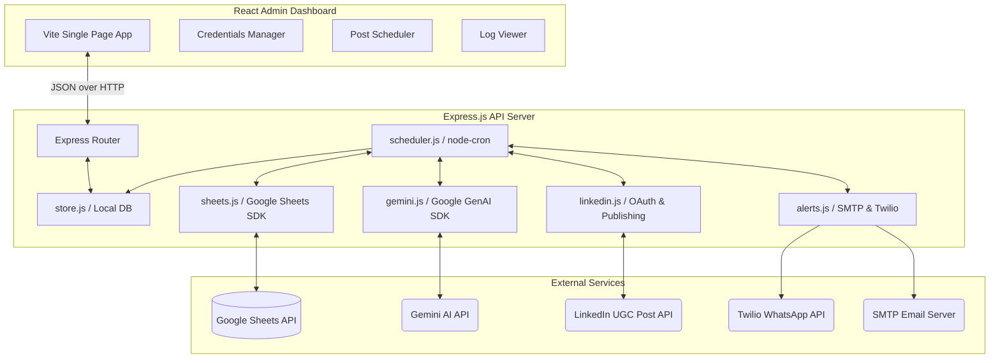

# 📐 Architectural Design & System Specifications

This document outlines the system architecture, component integrations, data models, state progression, and API specifications for the Automated LinkedIn Publishing Pipeline.

---

## 🏛️ System Architecture Overview

The system utilizes a modern decoupled client-server architecture:



---

## 🔄 Post State Progression

Every post moves through a structured state machine, synchronizing local database status with Google Sheets content:

```mermaid
stateDiagram-v2
    [*] --> Pending : Idea Added in Google Sheet
    Pending --> Drafted : Step 1: Gemini Generate Content
    Drafted --> Approved : Step 2: User Approval (Web Dashboard)
    Approved --> Published : Step 3: Publish to LinkedIn
    Published --> [*]

    state Pending {
        note right of Pending : Needs content generation.
    }
    state Drafted {
        note right of Drafted : Generates WhatsApp / Email notifications for review.
    }
    state Approved {
        note right of Approved : Blocked until scheduler triggers target publication time.
    }
    state Published {
        note right of Published : Locked. Content cannot be edited or republished.
    }
```

---

## 💾 Data Models & Database Schema

The backend uses a lightweight, transactional file-based storage manager ([`store.js`](file:///c:/Users/Graphics/Desktop/linkedin-automation/src/store.js)) reading/writing to `db.json`.

### `db.json` Structure
```json
{
  "settings": {
    "PORT": 5000,
    "GEMINI_API_KEY": "AIzaSy...",
    "GOOGLE_SHEET_ID": "1x-...",
    "GOOGLE_SERVICE_ACCOUNT_JSON": "{\"type\":\"service_account\",...}",
    "EMAIL_HOST": "smtp.gmail.com",
    "EMAIL_USER": "alert@domain.com",
    "EMAIL_PASS": "pass",
    "LINKEDIN_ACCESS_TOKEN": "AQ..."
  },
  "posts": [
    {
      "date": "2026-08-25",
      "time": "17:00",
      "title": "Optimizing Web App Performance",
      "analyticsStatus": "Passed LCP threshold",
      "messagePayload": "Here is how to optimize your web app performance...",
      "status": "Drafted",
      "approved": true
    }
  ],
  "logs": [
    {
      "timestamp": "2026-08-25T14:30:00.000Z",
      "type": "GEMINI_SUCCESS",
      "message": "Successfully drafted LinkedIn post using Gemini API."
    }
  ]
}
```

---

## 🔌 Integration Components

### 1. Google Sheets (`sheets.js`)
- **Authentication**: JWT authentication using Google Service Account credentials.
- **Reading**: Pulls columns `A` to `E` (`Date`, `Time`, `Title`, `Analytics_Status`, `Message_Payload`) from `Sheet1`.
- **Syncing**: Reconciles Google Sheet data with local database states. The local DB maintains the source of truth for UI-controlled states (like `approved`), while the sheet holds the content payload.
- **Writing**: Pushes generated draft text (`Message_Payload`) and updated metrics (`Analytics_Status`) back to the sheet.

### 2. Google Gemini AI (`gemini.js`)
- **Model**: `gemini-2.5-flash` via the official `@google/genai` SDK.
- **Roleplay Prompting**: Instructs the model to write in the professional persona of Sushanta Chowdhury (Frontend Developer and UI-UX specialist).
- **Fallback Mode**: If no `GEMINI_API_KEY` is present, the pipeline falls back to dynamic mock templates, avoiding execution failures during local testing.

### 3. LinkedIn API Client (`linkedin.js`)
- **OAuth 2.0**: Three-legged authorization code flow. Redirects to LinkedIn, handles callbacks, exchanges tokens, and saves them locally.
- **Publishing UGC**: Resolves member ID profile data via `/v2/me` and creates a post using the `/v2/ugcPosts` endpoint.

### 4. Alert Manager (`alerts.js`)
- **SMTP**: Uses `nodemailer` to dispatch status reports and manual override reminders.
- **Twilio WhatsApp**: Formats text messages and pushes notifications to the configured admin receiver, enabling mobile review links.

---

## ⚙️ Cron Scheduler Pipeline Flow

The orchestrator run-loop executes at regular intervals:

1. **Poll & Check**: Checks the local schedule for the current date.
2. **Draft Generation**: If `Message_Payload` is missing, triggers Gemini to draft content, updates the Google Sheet, and notifies the administrator.
3. **Check Approvals**: If the target publication time is reached and the post is marked as `approved`, triggers the LinkedIn client.
4. **Post-Publish Sync**: Updates the status in `db.json` and Google Sheet to `Published`, and sends a success notification.
